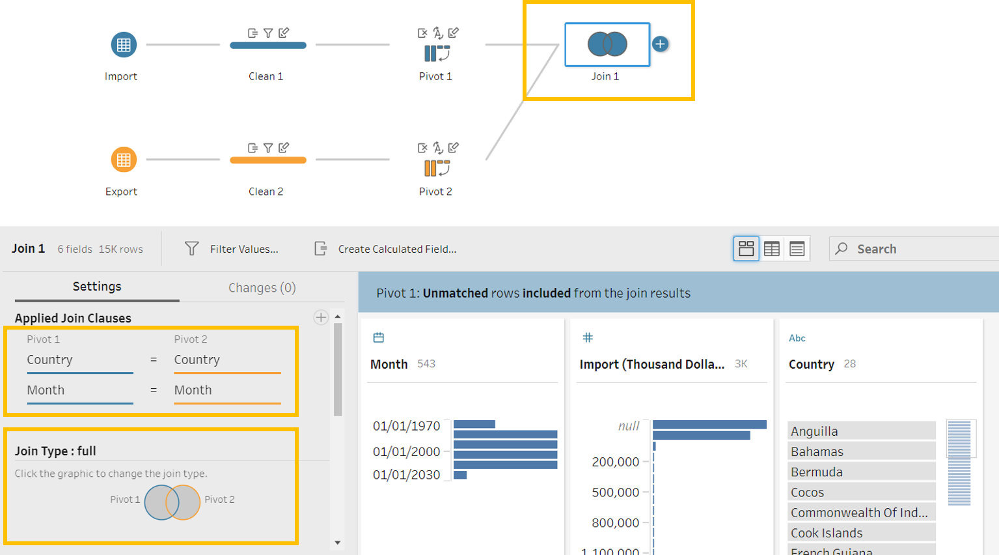
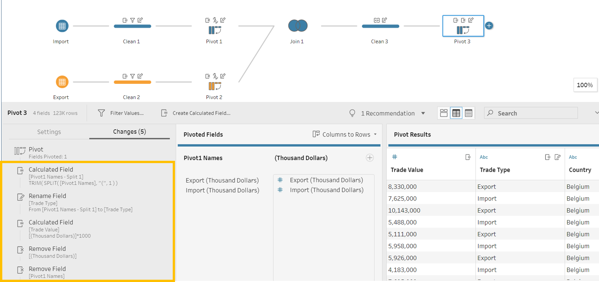

```{r setup, include=FALSE}
knitr::opts_chunk$set(echo = FALSE)
library(knitr)
```

# 1 Critique of Visualisation
The original visualisation is created by using data provided by Department of Statistics, Singapore (DOS). The data are available under the sub-section of [Merchandise Trade by Region/Market](https://www.singstat.gov.sg/find-data/search-by-theme/trade-and-investment/merchandise-trade/latest-data).


### 1.1 Clarity
1. **Titles**: The title and legend of the data visualization do not convey the message well. 
    +  Title mentions that the charts show merchandise trade of top six trading countries without clarifying that they are trading partners of Singapore. We are also unsure if the top six are selected based on total merchandise trade. 
    + One of the charts feature Hong Kong, which is a special administration region of China, not a country. 
    + The unit of measure is also not clear as neither the main title nor the legend title mention if the charts are measuring physical arrivals of merchandise or the monetary value of the merchandise. The source data reveals that the unit of measure is in Singapore dollars. 
    + Title indicates that the data is from 2019 to 2020 but the charts show values from 2019 to 2021. 
    + Title does not mention what is the granularity of the data presented (e.g. yearly, quarterly or monthly). 
    + No insights highlighted 
2. **Chart Type**: The area charts are standalone, making it hard for readers to compare the trade value across the partners. 
3. **Y-Axis**: The Y-axes of the charts are misleading.
    + The scales of the dual axes of each chart are not synchronised. For example, maximum scale value of export to Hong Kong with tick mark is 6M and 800K for import. The horizontal tick lines follow the primary Y-axis (export). As such, we cannot visually tell what is the relative value of export and import. 
    + Furthermore, the scales of the Y-axes are not fixed across the six charts, preventing us from determining the relative ranking of the six countries/regions based on their merchandise trade.
4. **X-Axis**: The X-axis of the charts are misleading.
    + The x-axis of the charts is labeled 'Month of Period' but only show the years without minor tick marks to indicate the months. We are unsure when does the data truly end. 
5. **Annotation / Source**: 
    + There is no annotation on the graph that highlights the significant finding or conclusion. 
    + There is no recognition of the data source. 


### 1.2 Aesthetic
1. **Legend**: The legend is placed on the right side of the chart. Readers could not immediately identify if the blue or yellow area refer to export or import. 
2. **Title**: The main graphic title's font size is smaller than the subtitle for each chart and not centralized. 
3. **Chart Order and Sizing**: There is no obvious logic in the ordering of the six charts. The chart widths vary. 
4. **Axis Labels**: The axis labels for Y-axis and X-axis are repeated unnecessarily. 
5. **Colours and Shading**: The area charts used blue and orange, which are friendly to color blind readers. And transparency is used to avoid occlusion issues. However, the overlap of blue and orange is distracting and prevent readers on focusing on the difference between export and import.
6. **Data Ink**: There is data ink on the axes labels but not the values of the tick marks.

# 2 Proposed Design
The initial sketch of proposed design is as follow:


### 2.1 Clarity
1. **Titles**: 
    + To use the term 'trade partners' to represent the countries and regions 
    + To add a main visual title to give readers the context - 'Singapore's Merchandise Trade with Major Partners'
    + To have a title for each chart that showcases the main insight. 
    + To add a functional subtitle for each chart. It should identify the granularity of the data, the unit of measure for the Y-Axis and the period covered. 
    + To rename the legend title to 'Trade Type'
2. **Chart Type**: 
    + Opt for trellis charts to allow easy comparison across the partners with 1 primary Y-axis
    + Add Chart 1, a bar chart to give readers an overview of how the 6 major trading partners are ranked based on annual total merchandise trade value and the changes in trade value year-on-year
    + Chart 2 will be a modified version of the original visualisation in trellis format
3. **Y-Axis**: 
    + Keep to a primary Y-axis 
    + Indicate the unit of measure '$X.XB' on the scales and indicate the granularity in the label '(Billions)'
4. **X-Axis**:
    + For Chart 2, indicate start of the year with 'Month' and 'Year' e.g. 'Jan'19' as major tick mark and every month as minor tick marks. Chart should not show 2021.
    + For Chart 2, add a reference line at start of 2020 to allow readers to easily compare between the monthly trends between 2019 and 2020
5. **Annotation / Source**: 
    + Add annotations to Chart 2 to highlight points that supports the insights
    + Add data source at foot of visualisation


### 2.2 Aesthetic
1. **Legend**: 
    + As the legend position is kept on the side, change the font color of the word 'Export' to blue and 'Import' to dark yellow to guide readers.
2. **Title**:  
    + Align the titles to the left 
    + Choose distinctive font sizes for main visual title, chart title and chart subtitles
3. **Chart Order and Sizing**: 
    + Rank the partners based on total trade value in the trellis charts
    + Align the tiles between Chart 1 and 2 so that readers can easily compare across charts if wanted
4. **Data Ink**: 
    + Enhance data ink for Y-axis and X-axis values and partner names 
5. **Axis Labels**:  
    + Remove both axis labels for 'Country' and 'Month' to avoid repetition and excess information
6. **Colours and Shading**: 
    + Remove the overlap between the blue and orange area
    + Overlay the area charts with line charts to allow users to identify the trend easier 

# 3 Proposed Visualisation on Tableau
Please view the proposed visualisation on Tableau Public [here](https://www.google.com/).

# 4 Step-By-Step Preparation
::: l-body
|No| Step                | Action                                       |
|--|---------------------|----------------------------------------------|
|1| Unzip the output folder downloaded from the SingStat website. Load the outputFile excel file into Tableau Prep Builder. Drag the ‘T1’ and ‘T2’ worksheet into main pane.| {#id .class width=100%}|
|2| Use the Data Interpreter. Rename ‘T1’ and ‘T2’ to ‘Import’ and ‘Export’ respectively and initiate the cleaning node from each data node. | {#id .class width=100%}|
|3| Under the ‘Clean 1’ node, clean ‘Variables’ using ‘Split Values’ with ‘(‘ as the separator. Rename column as ‘Country’. Repeat for ‘Clean 2’.| {#id .class width=100%}|
|4| Under ‘Clean 1’ node, filter the rows under ‘Country’ to remove non-Country and total observations. Repeat for ‘Clean 2’.| {#id .class width=100%}|
|5| Add Pivot nodes after ‘Clean 1’ and ‘Clean 2’. Under ‘Pivot 1’, select all months under ‘Fields’ to the ‘Pivoted Fields’ panel. Repeat for ‘Pivot 2’.| {#id .class width=100%}|
|6| Under ‘Pivot 1’, rename ‘Pivot1 Names’ to ‘Month’ and change data type to ‘Date’. Rename ‘Pivot1 Values’ to ‘Import (Thousand Dollars)’. Remove ‘Variables’. Repeat for ‘Pivot 2’ but rename ‘Pivot1 Values’ to ‘Export (Thousand Dollars)’.| {#id .class width=100%}|
|7| Do a full join between ‘Pivot 1’ and ‘Pivot 2’ with ‘Country’ and ‘Month’ as the join clauses.| {#id .class width=100%}|
|8| Create a ‘Clean’ node after ‘Join 1’ to merge duplicated country and month variables.| {#id .class width=100%}|
|9| Create a ‘Pivot’ node after ‘Clean 3’ and change ‘Export (Thousand Dollars)’ and ‘Import (Thousand Dollars)’ from columns to rows.| {#id .class width=100%}|
|10| Split ‘Pivot1 Names’ and rename the field of ‘Split 1’ to ‘Trade Type’. Multiply ‘(Thousand Dollars)’ by 1000 and rename it ‘Trade Value’. Remove the unnecessary fields ‘(Thousand Dollars)’ and ‘Pivot1 Names’.| {#id .class width=100%}|
|11| Create a ‘Output’ node after ‘Pivot 3’ node and save output as ‘Monthly Singapore Merchandise Trade’.| {#id .class width=100%}|
|12| Set up a connection on Tableau Desktop to the ‘Monthly Singapore Merchandise Trade’ hyper’s extract.| {#id .class width=100%}|
|13| For Chart 1, create a new worksheet and name it “Annual Trade’. Drag ‘Country’ and ‘Month’ to ‘Columns’ and ‘Trade Value’ to ‘Rows’ shelves.| {#id .class width=100%}|
|14| Drag ‘Month’ to the ‘Filter Field’ section. Select ‘Range of Dates’ and indicate ‘1 Jan 2019’ as the start and ‘1 Dec 2020’ as the end.| {#id .class width=100%}|
|15| Drag ‘Country’ to the ‘Filter Field’ section. Select the ‘Top’ tab and choose the top 6 by sum of ‘Trade Value’. Then exclude ‘Indonesia’ from the custom value list.| {#id .class width=100%}|
|16| Under ‘Marks’, select ‘Bar’ under the dropdown and drag ‘Trade Type’ to ‘Color’. Drag ‘Trade Value’ to ‘Label’ and add ‘Quick Table Calculation’ to add the ‘Percent of Total’ computed using ‘Cell’. Then drag ‘Trade Value’ to label again.| {#id .class width=100%}|
|17| Sort ‘Country’ based on descending sum of ‘Trade Value’.| {#id .class width=100%}|
|18| Click on the X-axis and add a reference line using the value of ‘SUM(Trade Value)’ at ‘Per Cell’ level. Remove the line.| {#id .class width=100%}|
|19| Format the trade values shown using ‘Currency (Custom)’ with ‘Billions (B)’ as display unit at 1 decimal place. And format the percentage from total value to 1 decimal place.| {#id .class width=100%}|
|20| Update the title to include a main active title and functional subtitle, colouring ‘Exports’ and ‘Imports’ aligning with the legend. Hide ‘Country / Month’. Add ‘(Billions)’ to ‘Trade Value’ label on the X-axis.| {#id .class width=100%}|
|21| For Chart 2, create a new worksheet and name it “Monthly Trade’. Drag ‘Country’ and ‘Month’ to ‘Columns’ and ‘Trade Value’ to ‘Rows’ shelves. Sort ‘Country’ by descending sum of ‘Trade Value’ and change ‘Month’ to month with year format. Repeat Step 14 to set up the date and country filters.| {#id .class width=100%}|
|22| Select ‘Area’ chart under ‘Marks’ and drag ‘Trade Type’ to ‘Color’. Then select ‘Analysis’ and switch ‘Stack Marks’ to ‘Off’.| {#id .class width=100%}|
|23| Under ‘Analysis’, select ‘Create Calculated Field’ to create a new variable called ‘Smaller Trade Value’ to select the minimum ‘Trade Value’ irrespective of ‘Trade Type’ based on each time period.| {#id .class width=100%}|
|24| Drag ‘Smaller Trade Value’ variable onto the ‘Trade Value’ axis to create a ‘combined axis’.| {#id .class width=100%}|
|25| Drag ‘Measure Names’ from ‘Rows’ shelf to ‘Detail’ under ‘Marks’. Then click on the ‘Detail’ icon next to ‘Measure Names’ and change it to ‘Color’.| {#id .class width=100%}|
|26| Click on ‘Colors’ under ‘Marks’ and edit the colours of the variables with ‘Smaller Trade Value’ to white. Change opacity to 100%.| {#id .class width=100%}|
|27| Drag ‘Trade Value’ to the secondary axis on the chart. There will be a new section appearing under ‘Marks’. Change the chart type to ‘Line’ under the dropdown and remove ‘Measure Names’.| {#id .class width=100%}|
|28| Click on the X-axis and add a reference line using a constant value indicating 1 Jan 2020. Remove the label and reduce the thickness of the dotted line.| {#id .class width=100%}|
|29| Remove the secondary axis, the legend for the area chart, the X-axis label and hide field labels for columns.| {#id .class width=100%}|
|30| Edit the X-axis to start on 1/1/2019 and end after 1/12/2020. Fix minor tick marks to start of the month and major tick marks to start of the year. Remove the axis titles.| {#id .class width=100%}|
|31| | {#id .class width=100%}|
|32| | {#id .class width=100%}|
|33| | {#id .class width=100%}|
|34| | {#id .class width=100%}|
|35| | {#id .class width=100%}|

:::


# 5 Major Observations
1. Overall insight
2. 
3. 

