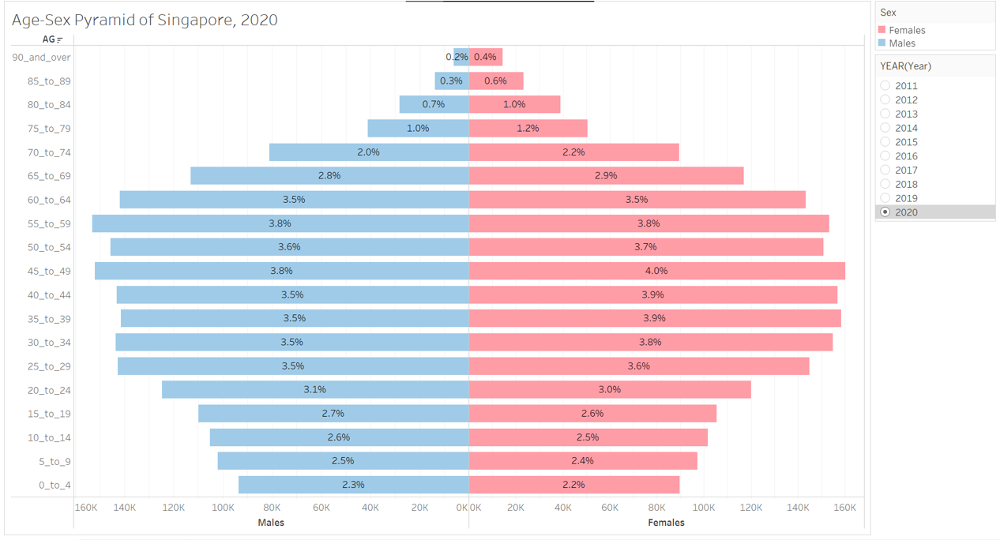
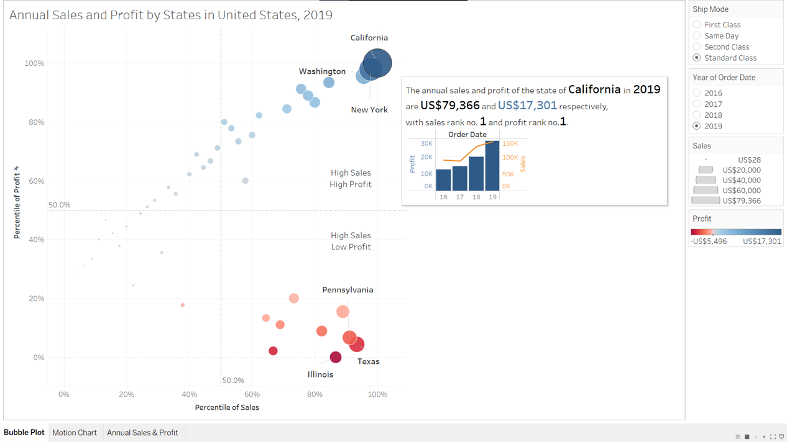
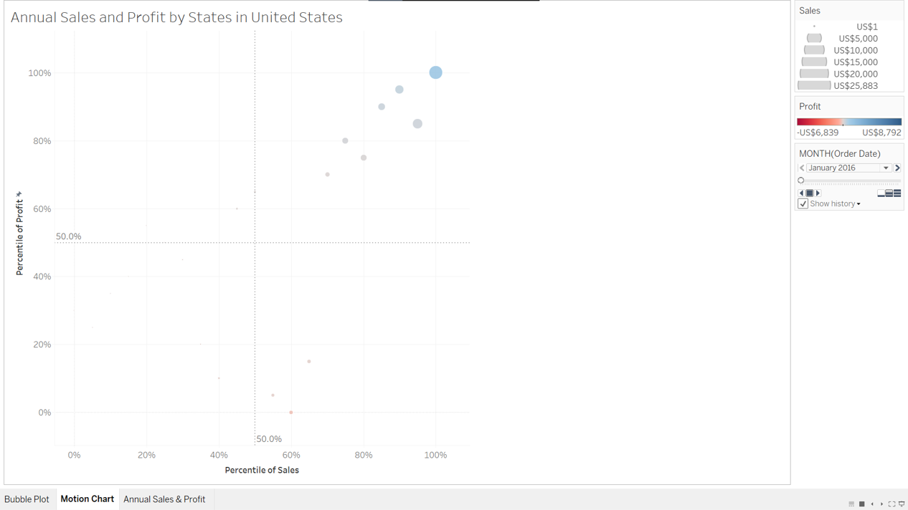
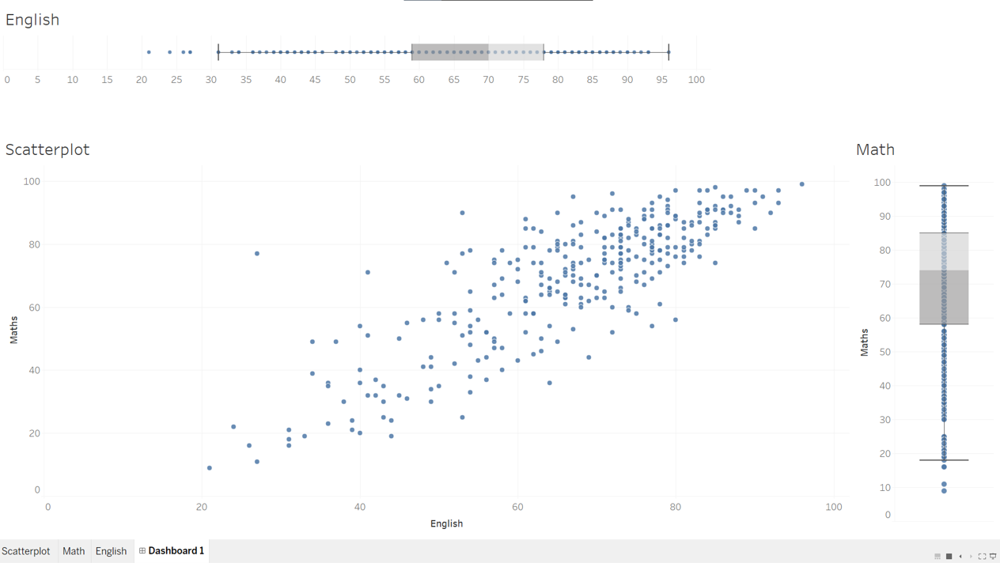

```{r setup, include=FALSE}
knitr::opts_chunk$set(echo = FALSE)
```

# 1. Age-Sex Pyramid of Singapore

Please view the interactive visualisation on Tableau Public [here](https://public.tableau.com/app/profile/kelly2850/viz/In-ClassExercise3/Age-SexPyramid).

{#id .class width=100%}

# 2. Quadratic Plot of Sales and Profit By States

Please view the interactive visualisation on Tableau Public [here](https://public.tableau.com/app/profile/kelly2850/viz/In-ClassExercise3-QuadraticPlot/SalesProfit).

{#id .class width=100%}
{#id .class width=100%}

# 3. Coordinate View of English and Math Scores

Please view the interactive visualisation on Tableau Public [here](https://public.tableau.com/app/profile/kelly2850/viz/In-ClassExercise3-CoordinateView/Dashboard1).

{#id .class width=100%}).

