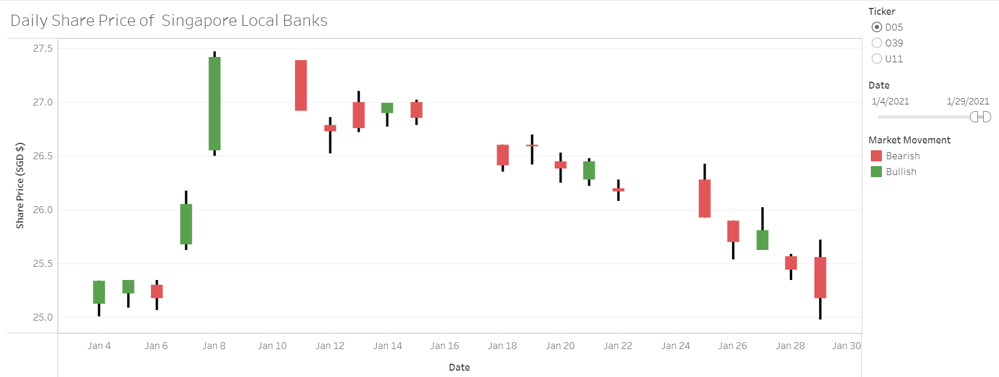

```{r setup, include=FALSE}
knitr::opts_chunk$set(echo = FALSE)
```

# 1. Bar Chart of Reproducible Research

Please view the interactive visualisation on Tableau Public [here](https://public.tableau.com/app/profile/kelly2850/viz/In-ClassExercise4-VisualizeUncertainty/BarChart).

{#id .class width=100%}

# 2. Dot Plot of Reproducible Research

Please view the interactive visualisation on Tableau Public [here](https://public.tableau.com/app/profile/kelly2850/viz/In-ClassExercise4-VisualizeUncertainty/DotPlot).

{#id .class width=100%}

# 3. Control Chart of Weekly Sales

Please view the interactive visualisation on Tableau Public [here](https://public.tableau.com/app/profile/kelly2850/viz/In-ClassExercise5-ControlChart/ControlChart).

{#id .class width=100%}

# 4. Candlestick Chart of Share Price of Singapore Local Banks

Please view the interactive visualisation on Tableau Public [here](https://public.tableau.com/app/profile/kelly2850/viz/In-ClassExercise5-CandlestickChart/Candlestick).

{#id .class width=100%}