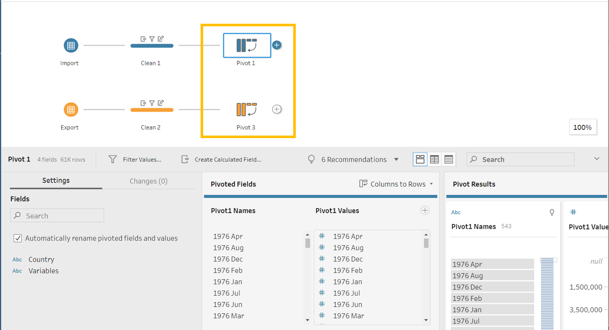
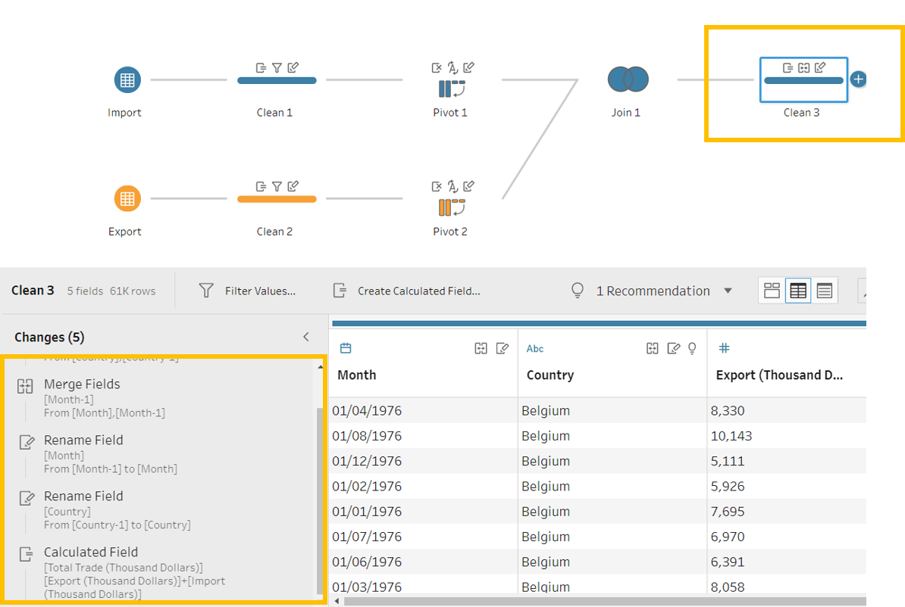

```{r setup, include=FALSE}
knitr::opts_chunk$set(echo = FALSE)
```

# 1. Critique of Visualisation
The original visualisation (Figure 1) is created by Department of Statistics, Singapore (DOS) as an [interactive infographic](https://www.singstat.gov.sg/modules/infographics/singapore-international-trade) to showcase Singapore's International Trade. The data are available under the sub-section of [Merchandise Trade by Region/Market](https://www.singstat.gov.sg/find-data/search-by-theme/trade-and-investment/merchandise-trade/latest-data).


### 1.1 Clarity
1. **Size of Bubbles**: Misleading size and no context.
    + A third set of figures (besides import and export value) determines the size of each bubble. However, there is no label to give it context. Readers can guess that it is the sum of export and import value after looking it a few bubbles but should not be forced to do so. 
    + The bubbles are not sized correctly. For example from Figure 2 below, by overlaying Thailand's bubble over Hong Kong's, we can easily tell that the visual designer doubled the diameter when the area should be doubled instead.  This gives an illusion that Hong Kong's total trade value dwarfs Thailand and render the whole representation a highly misleading one.

{#id .class width=50%}

2. **Geographical Level**: Varying levels used.
    + Markets of different geographical levels are being compared against each other. EU is an economic union of 27 members states; United States, Malaysia, Japan, Republic of Korea, Indonesia and Thailand are countries; and from Singapore's perspective, Mainland China, Hong Kong and Taiwan are regional territories. This also contradicts how trade in service is represented in the later part of the [infographic series](https://www.singstat.gov.sg/modules/infographics/singapore-international-trade) whereby EU members are represented at a country level, e.g. Switzerland and Netherlands as seen in Figure 3 below. The same geographical level should be used as far as possible except for special cases like Hong Kong, which has been treated as separate from Mainland China in trade and economics. 

{#id .class width=50%}
    
3. **Y-Axis & X-Axis**: Improper labeling of both axes.
    + Both axes do not indicate the unit of measurement used, which should be 'Export Value' and 'Import Value' with '$X.XB' as units.
    + There was no tick mark to provide reference for points on the scales. 
4. **Footnotes**: Inaccurate and redundant footnotes.
    + The first footnote mentions that the size of the bubble reflects the total merchandise trade value with the trading partner, which is incorrect as mentioned in 1.1.1 (Size of Bubbles). 
    + The first footnote also indicates that if the value of the imports exceed exports, the centre point (white circle) of the bubble falls into the 'Net Importers' section and vice versa for exports. However, a glance at the infographic shows that we are unable to see 4 of the countries' white circles, leaving readers guessing the trade status of EU and Republic of Korea since they are placed so close to the borders. 
    + The second footnote (see Figure 4 below) mentions that since 2009, Mainland China has changed from a net importer to a net exporter and US has changed from a net exporter to net importer since 2006. Firstly, the visualization has no data showing the change for both markets. Secondly, the chart contradicts the call-out on US. From the chart, we see US as a net exporter, which leaves the reader puzzled when has US changed from a net importer to a net exporter and the purpose of this call-out.

{#id .class width=100%}
    
5. **Title**: No context given.
    + No title was included with the visualization to set the context. There is uncertainty on the period of observation for the visualization and why are these markets chosen. However, we do see the header 'MERCHANDISE TRADE PERFORMANCE WITH MAJOR TRADING PARTNERS, 2020' when referring to the source website. 

### 1.2 Aesthetic
1. **Legend**: The legend for top net exporter and net importer is placed after the footnotes, making readers wonder the purpose of the star symbols in Figure 5 when looking at the visualization. 

{#id .class width=70%}

2. **Colours and Labels**: Visualization designer has made use of labels on the chart to determine each market. However, different colors are also used for each market even though there is no new information provided. 
3. **Opacity**: The white circles within the larger bubbles are suppose to help place the markets in net exporter and importer sections. However, occlusion issue plague the whole visualization as the bubbles overlap.  Many of the white circles could not be seen unless users interact with the visualization. And even so, an ambiguous case like the EU (see Figure 6 below) which lies close to the border still cannot be identified as an net importer or exporter.

{#id .class width=50%}

# 2. Proposed Design
The initial sketch of proposed design is as follow (Figure 7).


The charts in the proposed design will help to answer some of the questions:

- Who is Singapore's top trading partner? Did this change over the years?
- Who is the top net importer? Did this change over the years?
- Who is the top net exporter? Did this change over the years?
- Which partner has its trade value grown over the years? Is this driven by export or import?
- Which partner has its trade value shrunk over the years? Is this driven by export or import?
- How have the export and import trade value of each partner change over the years? 


### 2.1 Clarity
1. **Size of Bubbles**: 
    + Fix the size of the bubbles and add a legend to indicate the unit of measurement 'Annual Total Trade Value'
2. **Geographical Level**: 
    + Select the top 10 trade partners ranked by trade value at country and administrative zone level, which will exclude EU and include Germany.
3. **Y-Axis & X-Axis**: 
    + Include labels 'Import Value' and 'Export Value' as headers for the axes and indicate the unit '$X.XB' with tick marks for the bubble chart.
4. **Footnotes**: 
    + We have removed redundant footnote and chose not to annotate highlights of changes in trade performance of partners over the year to keep the design neat.
    + We will eliminate the uncertainty of the net importer and net exporter status with a separate chart that shows the ranks of partners by total trade value, net importer and net exporter status
    + We will include all historical export and import values and balance of trade figures of each partner under the tooltip function. This will aid readers who want to find out more about each market while not create clutter in the visualisation.
5. **Title**: 
    + Include a main dashboard title to set the context
    + Add title with key insight and a functional title with reference to the axes and granularity of the data


### 2.2 Aesthetic
1. **Legend**: 
    + Legends and notes that carry key information are placed on the left of the dashboard so that reader can quickly pick up the key information required when reading the bubble chart
2. **Colours and Labels**: 
    + Different colours are being used for each partners for the purpose of recognizing the trail of historical values in both charts as the visualization animates
    + Each bubble will retain the label with the name of the partner and total trade value of the year
    + Colours are chosen for each partner based on their geographical region, e.g. South East Asia markets like Thailand, Malaysia and Indonesia will adopt green hues, East Asia markets like Mainland China, Hong Kong, Japan, Taiwan, and Korea will adopt pink and purple hues. Germany and United States will adopt grey and brown respectively to distinguish themselves from the rest.
    + Import value and net importers will be represented by orange and export value and net exporters will be represented by blue so that they can be easily distinguished by color blind readers.
3. **Opacity**: 
    + Bubbles will be semi-transparent with white borders for readers to see the sizes clearly.

# 3. Proposed Visualisation on Tableau
Please view the proposed visualisation on Tableau Public [here](https://public.tableau.com/app/profile/kelly2850/viz/DatavizMakeover2_16241730883380/Dashboard).

{#id .class width=100%}

{#id .class width=100%}

# 4. Step-By-Step Preparation
::: l-body
|No| Step                | Action                                       |
|--|---------------------|----------------------------------------------|
|1| Unzip the output folder downloaded from the SingStat website. Load the outputFile excel file into Tableau Prep Builder. Drag the ‘T1’ and ‘T2’ worksheet into main pane.| {#id .class width=100%}|
|2| Use the Data Interpreter. Rename ‘T1’ and ‘T2’ to ‘Import’ and ‘Export’ respectively and initiate the cleaning node from each data node. | {#id .class width=100%}|
|3| Under the ‘Clean 1’ node, clean ‘Variables’ using ‘Split Values’ with ‘(‘ as the separator. Rename column as ‘Country’. Repeat for ‘Clean 2’.| {#id .class width=100%}|
|4| Under ‘Clean 1’ node, filter the rows under ‘Country’ to remove non-Country and total observations. Repeat for ‘Clean 2’.| {#id .class width=100%}|
|5| Add Pivot nodes after ‘Clean 1’ and ‘Clean 2’. Under ‘Pivot 1’, select all months under ‘Fields’ to the ‘Pivoted Fields’ panel. Repeat for ‘Pivot 2’.| {#id .class width=100%}|
|6| Under ‘Pivot 1’, rename ‘Pivot1 Names’ to ‘Month’ and change data type to ‘Date’. Rename ‘Pivot1 Values’ to ‘Import (Thousand Dollars)’. Remove ‘Variables’. Repeat for ‘Pivot 2’ but rename ‘Pivot1 Values’ to ‘Export (Thousand Dollars)’.| {#id .class width=100%}|
|7| Do a full join between ‘Pivot 1’ and ‘Pivot 2’ with ‘Country’ and ‘Month’ as the join clauses.| {#id .class width=100%}|
|8| Create a ‘Clean’ node after ‘Join 1’ to merge duplicated country and month variables.| {#id .class width=100%}|
|9| Create a ‘Pivot’ node after ‘Clean 3’ and change ‘Export (Thousand Dollars)’ and ‘Import (Thousand Dollars)’ from columns to rows.| {#id .class width=100%}|
|10| Split ‘Pivot1 Names’ and rename the field of ‘Split 1’ to ‘Trade Type’. Multiply ‘(Thousand Dollars)’ by 1000 and rename it ‘Trade Value’. Remove the unnecessary fields ‘(Thousand Dollars)’ and ‘Pivot1 Names’.| {#id .class width=100%}|
|11| Create a ‘Output’ node after ‘Pivot 3’ node and save output as ‘Monthly Singapore Merchandise Trade’.| {#id .class width=100%}|
|12| Set up a connection on Tableau Desktop to the ‘Monthly Singapore Merchandise Trade’ hyper’s extract.| {#id .class width=100%}|
|13| For the bubble chart, create a new worksheet and name it ‘Bubble Chart’. Click on ‘Analysis’ on the ribbon, and select ‘Create Calculated Field’ to create 2 calculated fields – ‘Export’ and ‘Import’ using the ‘IF X THEN X END’ formulas shown.| {#id .class width=100%}|
|14| Drag ‘Export’ to Columns and ‘Import’ to Rows and drag ‘Country’ to ‘Detail’ under Marks. Tableau will automatically present a scatter plot.| {#id .class width=100%}|
|15| Drag ‘Month’ to ‘Filters’ and select ‘Range of Dates’. Then input ‘1 Jan 2011’ as the start date and ‘1 Dec 2020’ as the end date. Next, drag ‘Country’ to ‘Filters’ and select ‘Top’ tab. We will select the top 10 partners by sum of the ‘Trade Value’.| {#id .class width=100%}|
|16| Drag ‘Trade Value’ to ‘Size’ under Marks and ‘Country’ to ‘Color’. Select on ‘Color’ under marks to change the default colors. Under ‘Select Color Palette’, select Tableau 20. Assign the partners as planned, East Asia markets with pink and purple hues, South East Asia markets in greenish hues, and Germany in Grey and US in brown.| {#id .class width=100%}|
|17| Change the type of charts under ‘Marks’ to ‘Circle’. Then select ‘Color’ to change the opacity of the bubbles to 65% and add a white border under ‘Effects’.| {#id .class width=100%}|
|18| To create a diagonal reference line in the bubble chart, create a new ‘Calculated Field’ called ‘Reference Line’ with ‘Export’ variable. Then drag the newly created ‘Reference Line’ to secondary Y-Axis position on the bubble chart as shown.| {#id .class width=100%}|
|19| Then click on the ‘SUM(Reference Line)’ section under ‘Marks’. Change the chart type from ‘Circle’ to ‘Line’ and only keep ‘Country’ under ‘Detail’. Next, change the ‘Size’ of the line to the thinnest and change the ‘Opacity’ to 0%. To bring out a nice reference line, right click on the reference line on the chart and select ‘Show Trend Lines’.| {#id .class width=100%}|
|20| Right click on the secondary Y-Axis to select ‘Synchronize Axis’ and uncheck ‘Show Header’. Right click on the trend line to format it to a light shade of grey and thinner profile. Discard ‘Measure Names’ under the ‘SUM(Import)’ section under ‘Marks’ to allow the colours of the markets to revert to initial selection.| {#id .class width=100%}|
|21| Drag ‘Month’ into ‘Pages’. Right click on the chart to add the year to the chart by selecting ‘Area’ under ‘Annotate’. Insert ‘<Page Name>’ and increase the font size to 36 color to light grey. Format the annotation to remove the shading.| {#id .class width=100%}|
|22| To shade the background diagonally to create ‘Net Importer’ and ‘Net Exporter’ segments, we create a simple square image with 2 triangles using powerpoint. We then load this image into Tableau using ‘Map’ > ‘Background Images’. Select the image created and position it on the chart carefully using the coordinates. Tweak the washout to avoid overwhelming the chart with colours.| {#id .class width=100%}|
|23| Add area annotations to the chart to mark the ‘Net Importer’ and ‘Net Exporter’ segments. Format each with the colour determined – orange for import and blue for export and remove the shading of the text.| {#id .class width=100%}|
|24| Drag ‘Country’ and ‘Trade Value’ to ‘Label’ under ‘Marks’. Format the labels – reduce font size to 8 and select ‘Match Mark Color’.| {#id .class width=100%}|
|25| Format all values on chart. Right click on the X-axis and select ‘Format’. A formatting pane will appear on the left. Under ‘Font’, change the font colour for X-Axis to blue. Under ‘Scale’, change the ‘Ticks’ to a darker grey and select ‘Currency (Custom)’ under ‘Numbers’ to format values to 1 decimal place in Billions. Repeat for Y-Axis (font colour in orange). Select ‘Label’ under ‘Marks’ to update the ‘Numbers’ format under ‘Pane’.| {#id .class width=100%}|
|26| Right click on the X-Axis and select ‘Edit Axis’. Under ‘General’ tab, uncheck ‘Include Zero’ and change ‘Title’ to ‘Export Value’. Switch to ‘Tick Marks’ tab and fix the ‘Major Tick Marks’ to $10B interval and remove minor tick marks. Repeat for Y-Axis with ‘Import Value’.| {#id .class width=100%}|
|27| Add the main insight title and functional title with the unit of measurement and granularity of data as shown. Allow the labels in the chart to be viewed by selecting ‘Always Show’ under ‘Mark Label’ for labels that are hidden. Shift the labels around the chart to ensure that can always be seen as the pages change. Under the pages’ control, check the ‘Show history’ box and show ‘All’ of ‘Trails’.| {#id .class width=100%}|
|28| Next, we prepare for charts that will provide more details of the partners under the tooltips when users explore the bubble charts. We create a new worksheet called ‘Tooltip Charts’. We want to feature 3 charts: i) annual trade value, ii) year-on-year change of annual trade value, iii) annual balance of trade. For chart iii), we create a new calculated field ‘Balance of Trade’ by taking sum of export minus sum of import as shown. Then, we add ‘Month’ to ‘Filters’ and select range like in Step 15. To set up the 3 charts, we drag ‘Month’ to ‘Columns’, ‘Trade Value’ and ‘Balance of Trade’ to ‘Rows’. Drag ‘Trade Value’ to ‘Rows’ again and select the drop down to do a quick table calculation – ‘Year Over Year Growth’.| {#id .class width=100%}|
|29| Change the chart type under ‘Marks’ to ‘Bar’ and ‘Line’ respectively as shown. For chart i) on total trade value, drag ‘Trade Type’ to ‘Color’. Export will be in blue and import will be in orange, similar for chart ii). For chart iii), drag ‘Balance of Trade’ to ‘Color’ and select ‘Custom Diverging’ with the center at 0, the negative end will be the orange selected for import and positive end will be the blue selected for export.| {#id .class width=100%}|
|30| Add values to the ‘Label’ section under each chart by dragging ‘Trade Value’ to ‘Label’ for chart i), ‘Trade Value YoY %’ to chart ii) and ‘Balance of Trade’ to chart iii). Next, format the labels to show them all at font size 8, allowing labels to overlap. Currency will be expressed in 1 decimal place in Billions and percentage in 1 decimal place using the same format procedure shown in step 25.| {#id .class width=100%}|
|31| Add the total trade value label by adding a reference line to chart i)’s Y-Axis. Select ‘Sum’ and indicate ‘Value’ under ‘Label’. Under ‘Formatting’, select ‘None’ for ‘Line’.| {#id .class width=100%}|
|32| After we are done with the tooltip charts, we will resize the chart by dragging the edges of the borders. We can continue to tweak after seeing how it fits under the bubble chart’s tooltip.| {#id .class width=100%}|
|33| As we want to indicate if the partner is a net exporter or net importer at the snapshot, we created new calculated fields ‘Net Exporter’ and ‘Net Importer’. Next, we also want to feature the rank of the partner by ‘Trade Value’, ‘Net Exporter’ and ‘Net Importer’, we created calculated fields to rank the partners as shown.| {#id .class width=100%}|
|34| Next, we will set up the tooltip content. Drag ‘Net Exporter’, ‘Net Importer’, ‘Rank by Trade Value’, ‘Rank by Net Exporter’ and ‘Rank by Net Importer’ all to ‘Tooltip’ under the ‘SUM(Import)’ section under ‘Marks’. Click on the ‘Tooltip’ icon to launch the editor and input the text interspersed with inserted variables as shown. Insert the ‘Tooltip Charts’ worksheet at the end of the text. Format the text by colouring all import related to be orange and export related to be blue.| {#id .class width=100%}|
|35| To start on the second chart on the dashboard to display rank, we create a new worksheet ‘Rank’. We then drag ‘Country’ and ‘Month’ to ‘Filters’ (similar to step 15) and ‘Month’ to ‘Pages’ to limit the country and years. We create the chart by dragging ‘Month’ to ‘Columns’ and ‘Rank by Trade Value’, ‘Rank by Net Importer’ and ‘Rank by Net Exporter’ to ‘Rows’. To have the ranking computed at country level, we drag ‘Country’ to ‘Color’ under ‘All’ section under ‘Marks’. Then, we can compute the rank using ‘Country’ ausing the dropdown option.| {#id .class width=100%}|
|36| To sync the animation with the bubble chart, we switch the chart type under ‘Marks’ to ‘Circle’ and reduce the size of the circle. Next, we will check the ‘Show history’ box for the control for ‘Pages’ on the right pane. To show the trails of the ranks, we will show history for ‘All’ and show ‘Trails’ marks only.| {#id .class width=100%}|
|37| To add tooltips to the rank charts, we drag the relevant variables to the ‘Tooltip’ icon under ‘Marks’ and insert them corresponding to the content we want to feature as shown.| {#id .class width=100%}|
|38| We will also need to refine the Y-Axes so that we show the ranking from top to bottom. To do that, we will edit all 3 axes so that the scales are reversed. To prevent the 0 from showing, we will format the scales using ‘Custom’ and adding a semi-colon and a space (‘; ’) behind the custom number format. For the net exporter and net importer scale, we will also colour the fonts with blue and orange respectively to sync with the bubble chart.| {#id .class width=100%}|
|39| A final touch to the rank charts is to add a main title and a functional title as shown.| {#id .class width=100%}|
|40| We are finally ready to pull the 2 charts together to form a dashboard. Create a new dashboard and drag the ‘Bubble Chart’ and ‘Rank’ sheets to the panes as shown. Next, format the legend so that they are presented on the left side of the bubble chart. In order to prompt users to play the animation, we change the Pages header to ‘Play Animation’. Lastly, we add a main dashboard header and a footnote to point readers to the data source.| {#id .class width=100%}|
|41| Once completed, we hide the worksheets and proceed to publish the dashboard on Tableau Public.| {#id .class width=100%}|
:::

# 5. Major Observations
1. **Rank Overview**:
- From the rank chart below (Figure 10), we observe that out of Singapore's top 10 merchandise trade partners in 2020, 6 are net exporters with Hong Kong always topping the list. The other 4 are net importers with Taiwan topping since 2018. 
- Mainland China has been Singapore's top merchandise trade partner since it overtook Malaysia in 2013. 
- There are several switchers among the major partners: South Korea switched from a net importer to net exporter in 2017, Malaysia switched to net importer in 2019 and United States switched to net exporter in 2020.
- Greatest dip in rank: Indonesia had seen the greatest drop in rank, from 3rd in 2011 to 7th in 2020. 
- Greatest climb in rank: Taiwan had climbed from 8th position in 2011 to 4th in 2020. 
- We will look at the bubble chart to understand the drivers for the changes mentioned above.


2. **Indonesia - sharp decline driven by lower exports**:
- From bubble chart and tooltip chart below (Figure 11), we see that Singapore's export to Indonesia had shrunk almost every year, except in 2017 and 2018. The dip was the steepest in 2020 with -20.8% YoY. This has led to a big drop in annual trade value with Indonesia - the decline was more than $30B in annual trade over the 10 years. 
- As a result, the balance of trade with Indonesia in 2020 has also shrank to a third of 2011 to $10.3B. 
- A [Business Times article](https://www.businesstimes.com.sg/sme/indonesia-a-market-where-obstacles-and-opportunities-co-exist) suggests that while Indonesia is a fast growing country with business opportunities, Singapore companies face infrastructural and regulatory hurdles in their expansion. In addition, the depreciation of Indonesia rupiah might have weakened the trade performance. 

{#id .class width=100%}

3. **Mainland China - saturating growth with trade war and pandemic**:
- From bubble chart and tooltip chart below (Figure 12), we notice that trade between Mainland China was not all smooth-sailing through the years. There were 2 major dips in exports in 2016 and 2018 respectively. Total trade value had been hovering between $135B-$137B since 2017. 
- The US-China trade war that started in 2018 led to a slowdown in the Chinese economy, which in turn reduced China’s import demand. Singapore's export to Mainland China trended in line, dipping -8.8% in 2018. The respite in 2019 when exports grew 3.5% was short-lived. In 2020, as the the world battles the COVID-19 pandemic, export to Mainland China grew marginally at 0.6%.
- Singapore's demand for Mainland China's exports has grew over the years but had seen a slowdown from 2019. This might be due to the slowdown in global economic growth and lower demand in electronics. 


{#id .class width=100%}

4. **United States - growth disrupted by pandemic**:
- From the bubble chart and tooltip chart below (Figure 13), we see that total trade with US spiked in 2018. In 2020, with the start of the COVID-19 pandemic, total trade with US dipped as imports from US plunged 19% YoY. We see divergence in export and import growth, resulting in US becoming a net exporter (+$5.7B) for the first time in the last 10 years. 
- With the start of new trade war between US and China in 2018, US tariffs on China led to a trade diversion, making players like Singapore more competitive in the US market. In line with this hypothesis, we observe the greatest year-on-year growth in both US exports and imports in 2018, suggesting that it is likely that Singapore has gained from the trade war. 

{#id .class width=100%}

5. **Malaysia - weak export led to net importer status change**:
- Based on the bubble chart and tooltip chart below (Figure 14), we see that Malaysia's annual total trade value in 2020 has shrunk compared to 2011. This is mainly due to weakening exports since 2014. 
- Exports to Malaysia saw recovery briefly in 2017 and 2018, followed by a decline in 2019 before tumbling to a new low in 2020 when the pandemic hit.  
- Uncertainties from the US-China trade war might have led to weaker business confidence, weighing down the demand from Malaysia in 2019. 
- Lower exports coupled with steady demand for Malaysia's exports led to Malaysia switching to a net importer in 2019 (-$0.7B).  

{#id .class width=100%}
