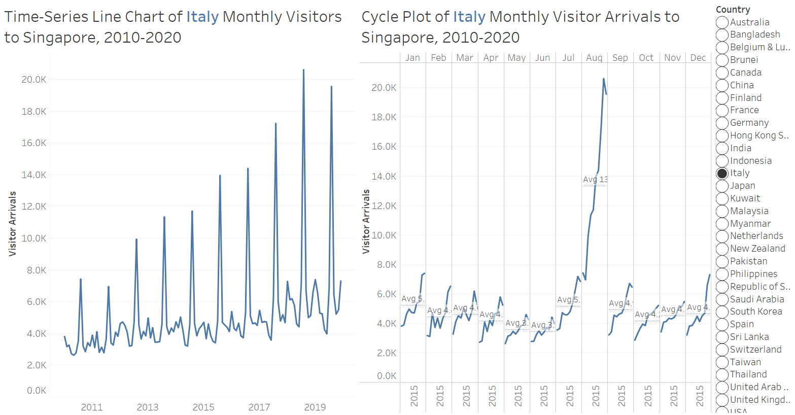
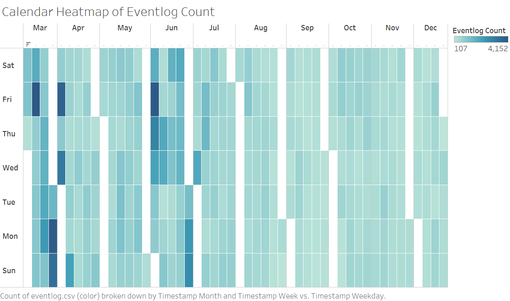
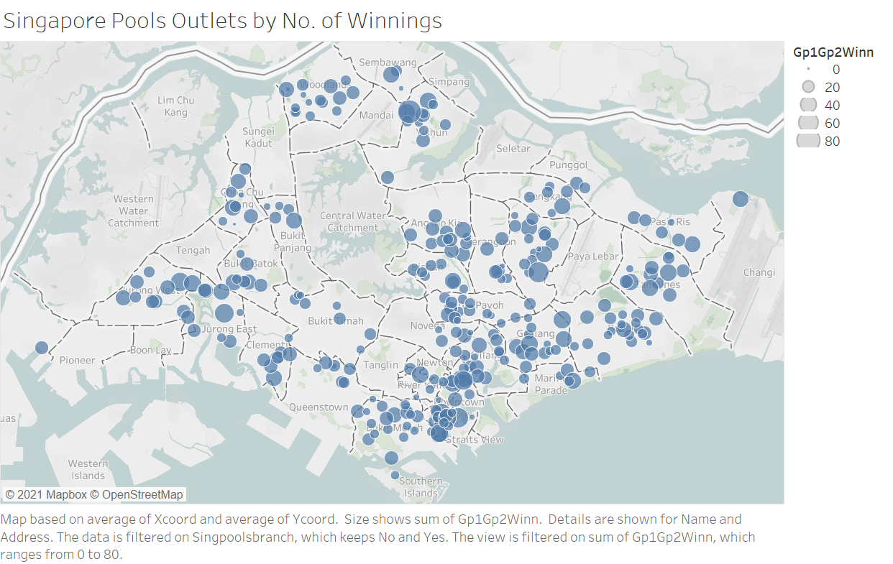

```{r setup, include=FALSE}
knitr::opts_chunk$set(echo = FALSE)
```

# 1. Time-Series Cycle Plot of Monthly Tourist Arrivals to Singapore 

Please view the interactive visualisation on Tableau Public [here](https://public.tableau.com/app/profile/kelly2850/viz/In-ClassExercise5-TimeSeries/Dashboard1).

{#id .class width=100%}

# 2. Time-Series Calendar Heatmap of Eventlog

Please view the interactive visualisation on Tableau Public [here](https://public.tableau.com/app/profile/kelly2850/viz/In-ClassExercise5-CalendarHeatmap/Heatmap).

{#id .class width=100%}

# 3. Proportional Symbol Map of Singapore Pools Outlets by Winnings

Please view the interactive visualisation on Tableau Public [here](https://public.tableau.com/app/profile/kelly2850/viz/In-ClassExercise6-ProportionalSymbolMap/ProportionalSymbolMap).

{#id .class width=100%}
# 4. Proportional Symbol Map of Private Estate Transactions

Please view the interactive visualisation on Tableau Public [here](https://public.tableau.com/app/profile/kelly2850/viz/In-ClassExercise6-ProportionalSymbolMap/ProportionalSymbolMap).

{#id .class width=100%}