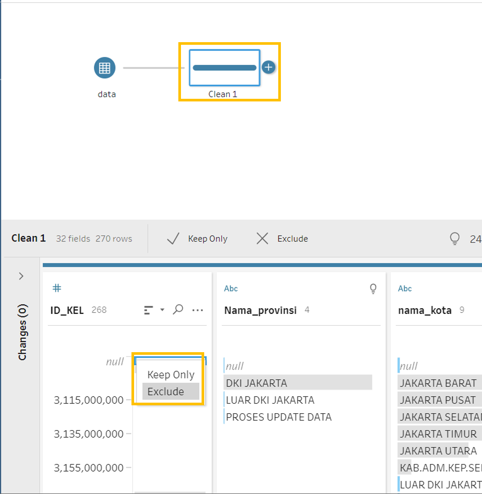
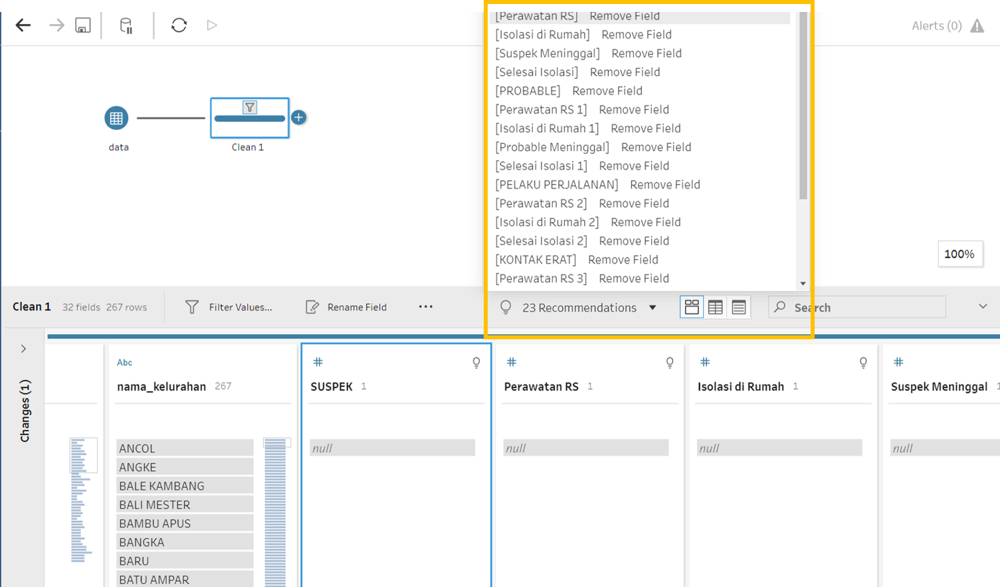
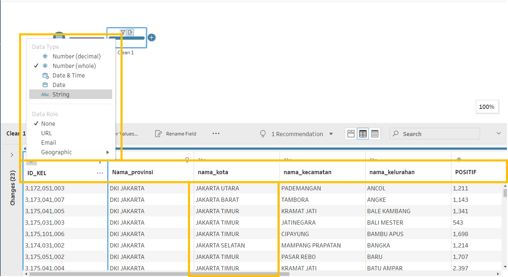
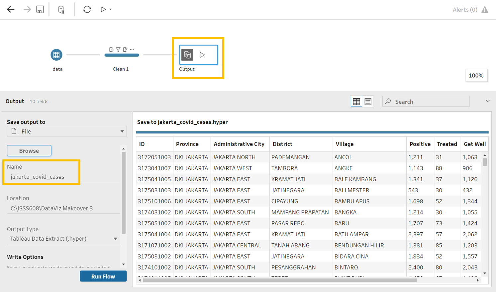
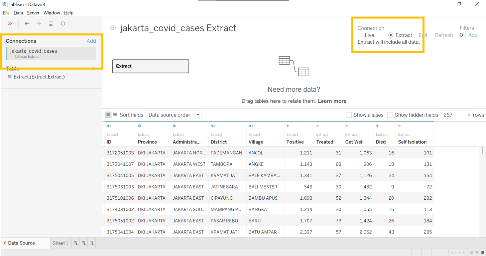

```{r setup, include=FALSE}
knitr::opts_chunk$set(echo = FALSE)
```


# 1. Critique of Visualisation
The original visualizations (Figure 1 and 2) are prepared by a data journalist to support the news write-up of the latest COVID-19 situation in DKI Jakarta. The data behind the visualization is from [Open Data Covid-19
Provinsi DKI Jakarta](https://riwayat-file-covid-19-dki-jakarta-jakartagis.hub.arcgis.com/).


### 1.1 Clarity

### 1.2 Aesthetic


# 2. Proposed Design
The initial sketch of proposed design is as follow (Figure ).


### 2.1 Clarity

### 2.2 Aesthetic


# 3. Proposed Visualisation on Tableau
Please view the proposed visualisation on Tableau Public [here]().

{#id .class width=100%}


# 4. Step-By-Step Preparation

Before we dive into cleaning the data, we took time to understand the Excel worksheets and data variable names as they are expressed in Bahasa Indonesia. There are 2 worksheets in the excel workbook:

- `data`: lowest level of geographic granularity is at village level 
- `data_kecamatan`: lowest level of geographic granularity is at district level

Both worksheets have similar columns besides the geographical variables. Of which, we are only interested in the `Positive` section where is there information village and district level. Common columns includes:

- Suspect
- Probable
- Travelers
- Close Contact
- Discarded
- Positive: Treated, Get Well, Died, Self-Isolation
- Information

We will only load the `data` worksheet which is more granular at village level and keep the `Positive` section and its breakdown during data cleaning. 


::: l-body
|No| Step                | Action                                       |
|--|---------------------|----------------------------------------------|
|1| Downloaded the ‘30 Juni 2021 Pukul 10.00’ file from the Open Data Covid-19 Provinsi DKI Jakarta site. Load the ‘Standar Kelurahan Data Corona (30 Juni 2021 Pukul 10.00)’ excel file into Tableau Prep Builder. Check the ‘Data Interpreter’. Drag the ‘data’ worksheet into main pane as data node and create a ‘Clean’ node after the ‘Data’ node.| {#id .class width=100%}|
|2| Click on ‘Clean 1’ node – under ‘ID_KEL’, click on ‘NULL’ values and exclude them.| {#id .class width=100%}|
|3| Remove the unnecessary fields with null values. We can make use of the ‘Recommendations’ to help.| {#id .class width=100%}|
|4| Correct the formats of the ID column from number to string. Rename the columns in English by double clicking on the column names. Rename the administrative cities to English.| {#id .class width=100%}|
|5| xxx| {#id .class width=100%}|
|6| xxx| {#id .class width=100%}|
|7| xxx| {#id .class width=100%}|
|8| xxx| {#id .class width=100%}|
|9| xxx| {#id .class width=100%}|
|10| xxx| {#id .class width=100%}|
|11| xxx| {#id .class width=100%}|
|12| xxx| {#id .class width=100%}|
|13| xxx| {#id .class width=100%}|
|14| xxx| {#id .class width=100%}|
|15| xxx| {#id .class width=100%}|
|16| xxx| {#id .class width=100%}|
|17| xxx| {#id .class width=100%}|
|18| xxx| {#id .class width=100%}|
|19| xxx| {#id .class width=100%}|
|20| xxx| {#id .class width=100%}|
|21| xxx| {#id .class width=100%}|
|22| xxx| {#id .class width=100%}|
|23| xxx| {#id .class width=100%}|
|24| xxx| {#id .class width=100%}|
|25| xxx| {#id .class width=100%}|
|26| xxx| {#id .class width=100%}|
|27| xxx| {#id .class width=100%}|
|28| xxx| {#id .class width=100%}|
|29| xxx| {#id .class width=100%}|
|30| xxx| {#id .class width=100%}|
|31| xxx| {#id .class width=100%}|
|32| xxx| {#id .class width=100%}|
|33| xxx| {#id .class width=100%}|
|34| xxx| {#id .class width=100%}|
|35| xxx| {#id .class width=100%}|
|36| xxx| {#id .class width=100%}|
|37| xxx| {#id .class width=100%}|
|38| xxx| {#id .class width=100%}|
|39| xxx| {#id .class width=100%}|
::: 


# 5. Major Observations
1. **Overview**:


