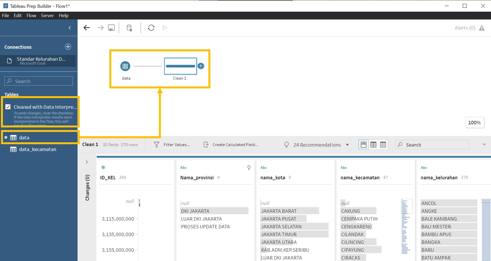

```{r setup, include=FALSE}
knitr::opts_chunk$set(echo = FALSE)
```


# 1. Critique of Visualisation
The original visualizations (Figure 1 and 2) are prepared by a data journalist to support the news write-up of the latest COVID-19 situation in DKI Jakarta. The data behind the visualization is from [Open Data Covid-19
Provinsi DKI Jakarta]https://riwayat-file-covid-19-dki-jakarta-jakartagis.hub.arcgis.com/).


### 1.1 Clarity

### 1.2 Aesthetic


# 2. Proposed Design
The initial sketch of proposed design is as follow (Figure ).


### 2.1 Clarity

### 2.2 Aesthetic


# 3. Proposed Visualisation on Tableau
Please view the proposed visualisation on Tableau Public [here]().

{#id .class width=100%}


# 4. Step-By-Step Preparation
::: l-body
|No| Step                | Action                                       |
|--|---------------------|----------------------------------------------|
|1| xxx| {#id .class width=100%}|


# 5. Major Observations
1. **Overview**:


