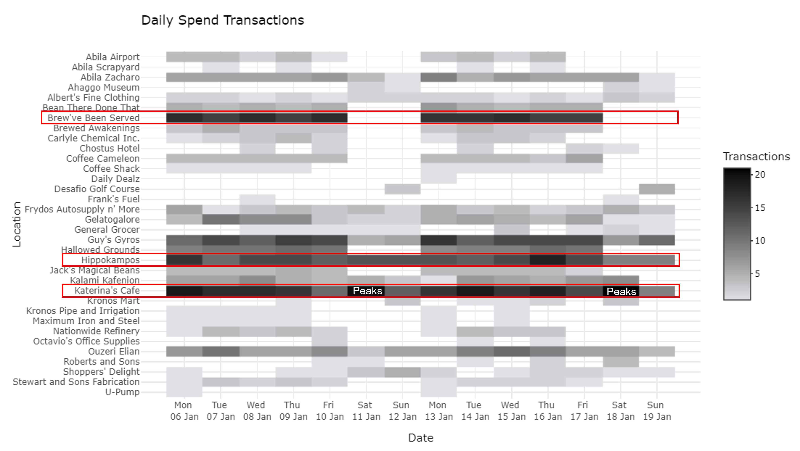
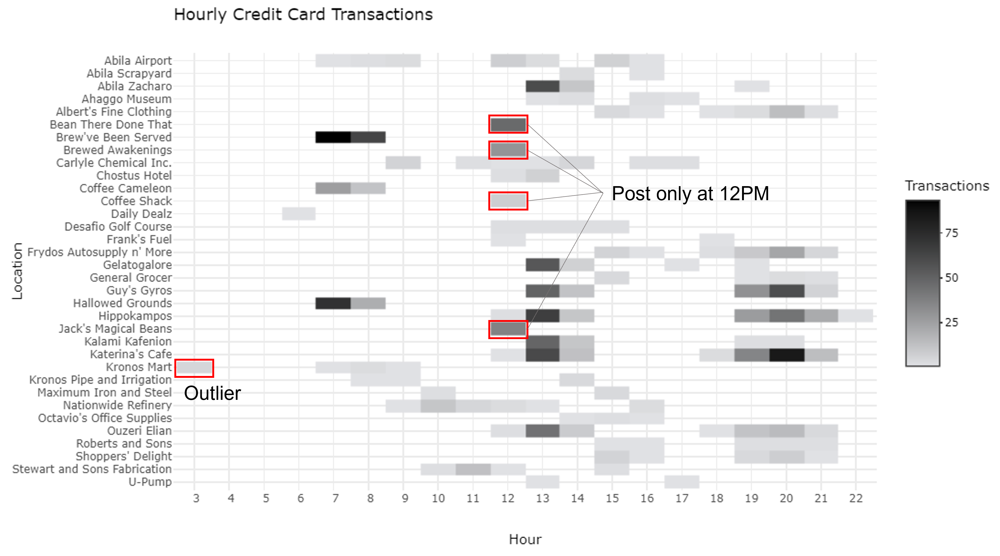
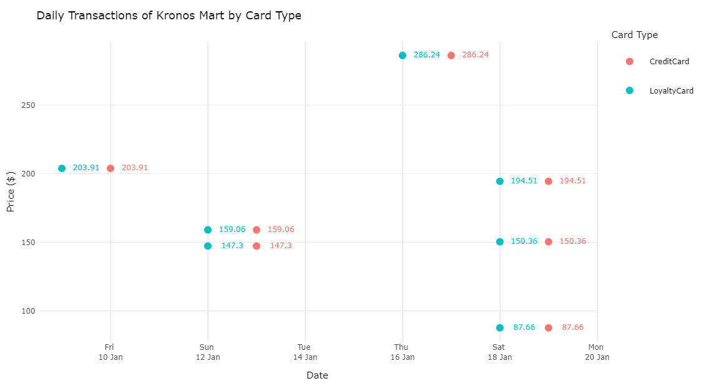
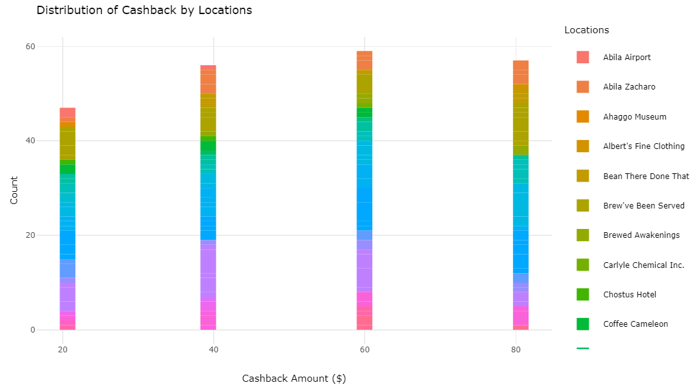
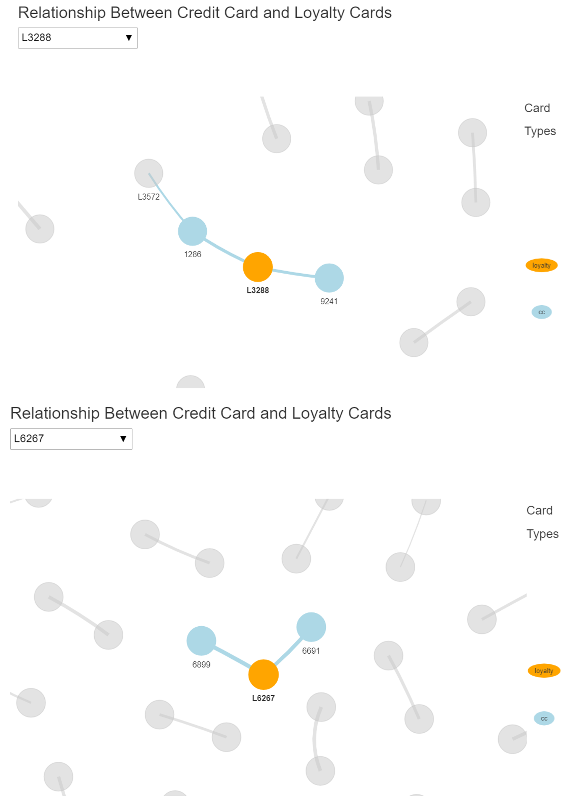
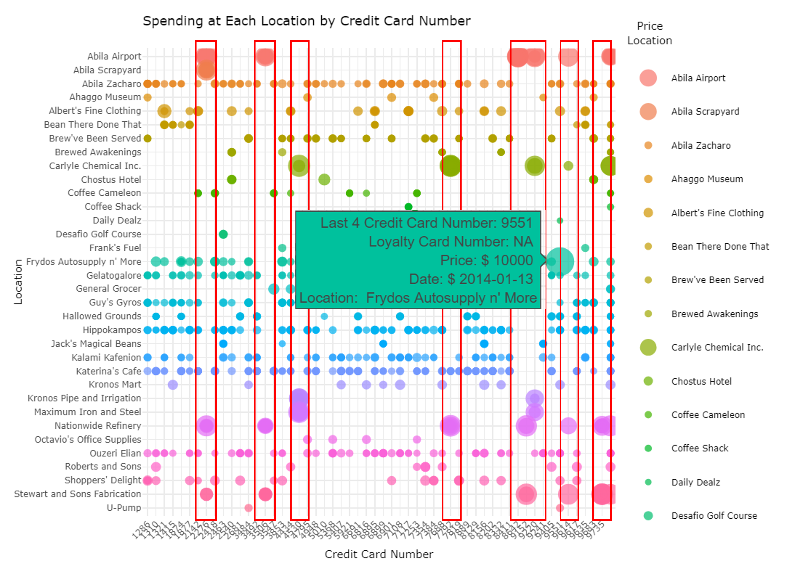

```{r setup, include=FALSE}
options(htmltools.dir.version = FALSE)
knitr::opts_chunk$set(fig.retina = 3,
                      include = TRUE,
                      echo = FALSE,
                      eval = TRUE,
                      message = FALSE,
                      warning = FALSE)
```

[Part 1: Background and Methodology](https://kellykkw.netlify.app/posts/2021-07-25-individual-assignment-part-1/) 

[Part 2: R Packages, Data and Analysis](https://kellykkw.netlify.app/posts/2021-07-25-individual-assignment-part-2/) 

[Part 3: Insights and Conclusion](https://kellykkw.netlify.app/posts/2021-07-25-individual-assignment-part-3/) 


## Insights and Conlusions

### Question 1 
Using just the credit and loyalty card data, identify the most popular locations, and when they are popular. What anomalies do you see? What corrections would you recommend to correct these anomalies? Please limit your answer to 8 images and 300 words. 

#### Q1 Most popular locations
The top 3 popular locations belong to the Food categories, such as Katerina's Cafe, Brew've Been Served and Hippokampos. Katerina's Cafe peaks on Saturday, Hippokampus is busier on weekdays than weekends and Brew've been Served is closed on weekends.
{#id .class width=100%}

#### Q1 Anomaly - Credit Card Posting at Fixed Hour
Some locations only have credit card transactions posted in 1 hour within the day e.g. Bean There Done That and Brewed Awakenings, Jack's Magical Beans, Coffee Shack at 12PM.
Corrections: Correct posting timing if GPS record shows otherwise.
{#id .class width=100%}

#### Q1 Anomaly - Kronos Mart Post Credit Card Record 1 Day Late
Kronos Mart's credit card postings usually come 1 day late, which result in strange timing of postings at 3-9AM. 
Corrections: Correct posting timing based on available GPS record or take the date of loyalty card record.
{#id .class width=100%}

#### Q1 Anomaly - Cashbacks in Multiples of $20
Some loyalty card transactions have prices lower than the corresponding credit card transactions. The denominations are usually in multiples of $20, ranging from $20 to $80. Locations vary widely, suggesting a loyalty cashback scheme. 
Corrections: Use credit card amount as loyalty price is non-consequential to investigation.
{#id .class width=100%}

#### Q1 Anomaly - Multiple Credit Cards to Loyalty Cards
Unexpected relationships between credit card 1286 and loyalty card L3288, and loyalty card L6267 is associated with credit cards 6691 & 6899.
Corrections: Care was taken to join credit card and loyalty card transactions to prevent duplication.
{#id .class width=100%}

#### Q1 Anomaly - High Spend Due to Possible Fraud
The highest spend on the credit card is $10k on Frydos Autospply n' More that does not have a loyalty card transaction, belonging to credit card 9551. 9 credit cards register many high spends that are at industrial areas tying to the 9 truck drivers. The other highest spend that is not in industrial location is on Albert's Fine Clothing by credit card 1321. 
{#id .class width=100%}

We noticed that there is a gap between the the $10k spend on 13 Jan and the next purchase by credit card 9551 on 16 Jan. This suggests that the high spend might be due to fraud.

#### Q1 Anomaly - Sparse Spends due to Multiple Cards 


### Question 2
Add the vehicle data to your analysis of the credit and loyalty card data. How does your assessment of the anomalies in question 1 change based on this new data? What discrepancies between vehicle, credit, and loyalty card data do you find? Please limit your answer to 8 images and 500 words.


#### Q2 Anomaly - Confirm Credit Card Posting at Fixed Hour was Wrong
Bean There Done That, Brewed Awakenings and Jack's Magic Beans only operate in weekday mornings and posted credit card transactions at 12 noon.


#### Q2 Anomaly - Confirm Kronos Mart Posting was Wrong
Kronos Mart's credit card postings were posted around 12 hours after purchase. 

#### Q2 Anomaly - Confirm High Spend due to Fraud
Minke(24) likely stole Lars(1) credit card and made several spends, including a likely online purchase on Daily Dealz,  and $10,000 at Frydos Autosupply n 'More.


#### Q2 Anomaly - Mismatch of Credit Card Location and GPS Location due to Car Pooling and Shared Purchases
Kanon and Borrasca often drive out and hang out for meals, they 


#### Q2 Anomaly - Mismatch of Credit Card Location and GPS Location due to Change of Credit Cards
Bertrand (29) changed his credit card after the first week. 


#### Q2 Anomaly - Gustav(9)'s Mismatch of Credit Card Location and GPS Location 
There are transactions on Gustav's credit card in the evenings when his GPS location shows that he should be at home. We suspect Gustav took other transportation (e.g. walk or cycle) to the shops near his home such as Hippokampus and Albert's Fine Clothing to make those purchase.


### Question 3
Can you infer the owners of each credit card and loyalty card? What is your evidence? Where are there uncertainties in your method? Where are there uncertainties in the data? Please limit your answer to 8 images and 500 words.

#### Q3 Owners of Credit Cards and Loyalty Card

#### Q3 Evidence - Credit Card Spends without GPS Location Corroborated

#### Q3 Uncertainty - Locations Cluster Close to Each Other


### Question 4
Given the data sources provided, identify potential informal or unofficial relationships among GASTech personnel. Provide evidence for these relationships. Please limit your response to 8 images and 500 words.

#### Q4 Relationships - Inga(13), Isia(16), Loreto(15), Hennie(21), Minke(24) conducting suspicious activities together


#### Q4 Relationships - Elsa(7) and Brand(33) have rendezvous at Chostus Hotel
Elsa(7) and Brand(33) visited Chostus Hotel on the same weekday afternoons for four different days. They drove their own cars and paid using their own credit cards. 


#### Q4 Relationships - Kanon(22) and Borrasca(28) are seeing each other
Kanon and Borrasca often drive out and hang out for meals. Kanon also visits Borrasca's home at times. On Jan 18, Kanon and Borrasca went to Capitol in the morning, and to Museum at noon, to Hippokampos in the afternoon, and to Borrasca's home at night together.


#### Q4 Relationships - Dinner party among employees from Engineers and IT departments
Lars held a home party on the evening of Jan 10, returning home earlier around 5PM that evening to prepare for it. He invited at least 15 colleagues: 12 people from the engineering department and 4 people from the IT department who stayed between 7PM and 11PM.


#### Q4 Relationships - Shared homes of employees


#### Q4 Relationships - Hennie's (21) second home


#### Q4 Relationships - Executives' weekend golf
Over the two weekends, the executives all went to play golf. Orhan missed the first weekend and joined only when CEO Sten joined when he was in Aliba.


#### Q4 Relationships - Sharing 1 Loyalty Card


### Question 5
Do you see evidence of suspicious activity? Identify 1- 10 locations where you believe the suspicious activity is occurring, and why. Please limit your response to 10 images and 500 words.


#### Q5 Location - Drives to 5 unknown houses
Inga(13), Loreto(15), Hennie(21), Minke(24) repeatedly visited five suspicious places around the middle of the day. These places cannot be identified via credit card transactions nor were accessed by other employees.

#### Q5 Location - Surveillance on Executives' houses
Isia(16), 


#### Q5 Location - Surveillance at Executives' lunch spots


#### Q5 Location - Hennie's unusual home stays


#### Q5 Location - Kronos Capitol


#### Q5 Location - Bertrand's late night trip to several locations
Bertrand (29) took late night trip starting from his home around 10PM. He visited Guy's Gyros (10:15pm), Ouzeri Elian (10:29pm), Kalami Kafenion (10:40pm), Hippokampos (10:55pm), U-Pump (11:25pm) where he stays for 30 minutes before returning home at midnight.


