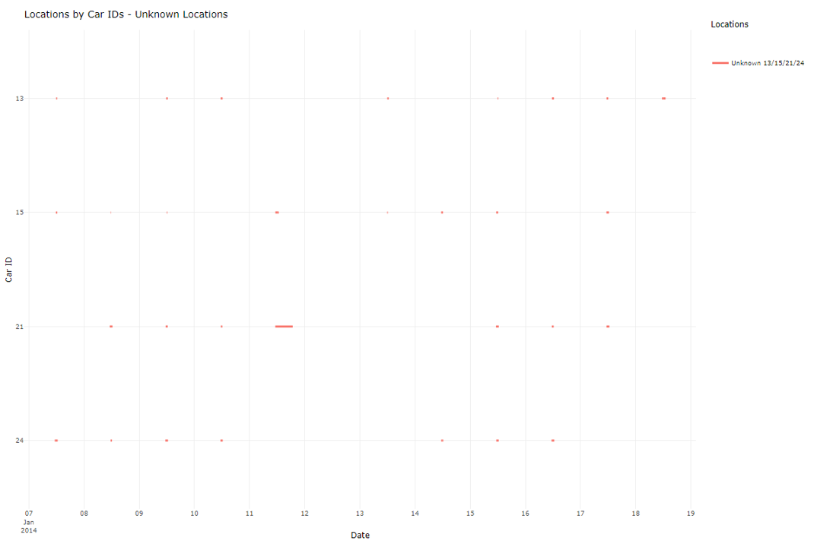

```{r setup, include=FALSE}
options(htmltools.dir.version = FALSE)
knitr::opts_chunk$set(fig.retina = 3,
                      include = TRUE,
                      echo = FALSE,
                      eval = TRUE,
                      message = FALSE,
                      warning = FALSE)
```

[Part 1: Background and Methodology](https://kellykkw.netlify.app/posts/2021-07-25-individual-assignment-part-1/) 

[Part 2: R Packages, Data and Analysis](https://kellykkw.netlify.app/posts/2021-07-25-individual-assignment-part-2/) 

[Part 3: Insights and Conclusion](https://kellykkw.netlify.app/posts/2021-07-25-individual-assignment-part-3/) 


## Insights and Conlusions

### Question 1 
Using just the credit and loyalty card data, identify the most popular locations, and when they are popular. What anomalies do you see? What corrections would you recommend to correct these anomalies? Please limit your answer to 8 images and 300 words. 

#### Q1 Most popular locations
The top 3 popular locations belong to the Food categories, such as Katerina's Cafe, Brew've Been Served and Hippokampos. Katerina's Cafe peaks on Saturday, Hippokampus is busier on weekdays than weekends and Brew've been Served is closed on weekends.
{#id .class width=100%}

#### Q1 Anomaly - Credit Card Posting at Fixed Hour
Some locations only have credit card transactions posted in 1 hour within the day e.g. Bean There Done That and Brewed Awakenings, Jack's Magical Beans, Coffee Shack at 12PM.
Corrections: Correct posting timing if GPS record shows otherwise.
{#id .class width=100%}

#### Q1 Anomaly - Kronos Mart Post Credit Card Record 1 Day Late
Kronos Mart's credit card postings usually come 1 day late, which result in strange timing of postings at 3-9AM. 
Corrections: Correct posting timing based on available GPS record or take the date of loyalty card record.
{#id .class width=100%}

#### Q1 Anomaly - Cashbacks in Multiples of $20
Some loyalty card transactions have prices lower than the corresponding credit card transactions. The denominations are usually in multiples of $20, ranging from $20 to $80. Locations vary widely, suggesting a loyalty cashback scheme. 
Corrections: Use credit card amount as loyalty price is non-consequential to investigation.
{#id .class width=100%}

#### Q1 Anomaly - Multiple Credit Cards to Loyalty Cards
Unexpected relationships between credit card 1286 and loyalty card L3288, and loyalty card L6267 is associated with credit cards 6691 & 6899.
Corrections: Care was taken to join credit card and loyalty card transactions to prevent duplication.
{#id .class width=100%}

#### Q1 Anomaly - High Spend Due to Possible Fraud
Figure 6 shows that the highest spend on the credit card is $10k on Frydos Autosupply n' More that does not have a loyalty card transaction, belonging to credit card 9551. 9 credit cards (boxed in red) register many high spends that are at industrial areas likely tied to the 9 truck drivers. The other highest spend that is not in industrial location is on Albert's Fine Clothing by credit card 1321. 

{#id .class width=100%}

We noticed drom Figure 7 that there is a gap between the the $10k spend on 13 Jan and the next purchase by credit card 9551 on 16 Jan. This suggests that the high spend might be due to fraud.
{#id .class width=100%}

#### Q1 Anomaly - Sparse Spends due to Multiple Cards 
From Figure 8. below, we spot anomalies from the frequency of the spends worth investigating: 

- Early ends (highlighted in red) - Credit card 5921’s last spend was on 19 Jan 
- Late starts (highlighted in red) - Credit card 3547 started having spend on 12 Jan and 5010 started on 17 Jan 
- Sporadic records with high spends (highlighted in green) - Credit cards 2276, 3506, 4530, 7792, 8642 9152, 9220, 9614

{#id .class width=100%}

### Question 2
Add the vehicle data to your analysis of the credit and loyalty card data. How does your assessment of the anomalies in question 1 change based on this new data? What discrepancies between vehicle, credit, and loyalty card data do you find? Please limit your answer to 8 images and 500 words.


#### Q2 Anomaly - Confirm Credit Card Posting at Food Outlets at Fixed Hour was Wrong
Bean There Done That, Brewed Awakenings and Jack's Magic Beans only operate on weekday mornings and posted credit card transactions at 12 noon.

{#id .class width=100%}

#### Q2 Anomaly - Confirm Kronos Mart Posting was Wrong
Kronos Mart's credit card postings were posted around 12 hours after purchase. 

{#id .class width=100%}

#### Q2 Anomaly - Confirm High Spend due to Likely Fraud
Nils' (Car ID 1) credit card had several unexplained spends, including a likely purchase at U Pump and $10,000 at Frydos Autosupply n 'More. Minke (Car ID 24) was the only person at Frydos Autosupply n 'More when the high purchase was made on Nils' card (Figure 11). And they were both at Hippokampos together briefly between 11.24PM and 11:31PM before the fraudulent purchases start (Figure 12). 

{#id .class width=100%}

{#id .class width=100%}

#### Q2 Anomaly - Mismatch of Credit Card Location and GPS Location due to Car Pooling and Shared Purchases
Kanon (Car ID 22) and Borrasca (Car ID 28) often drive out and hang out for meals, they registered multiple purchases without supporting GPS locations (highlighted in red in Figure 13).

{#id .class width=100%}

#### Q2 Anomaly - Mismatch of Credit Card Location and GPS Location due to Change of Credit Cards
Bertrand (Car ID 29) changed his credit card from 5921 to 3547 on 12 Jan after an erratic night on 11 Jan late night, whereby he visited multiple places but registered no purchases. 

{#id .class width=100%}

#### Q2 Anomaly - Mismatch of Credit Card Location and GPS Location Due to Other Transport Means
There were transactions on Gustav's (Car ID 9) credit card in the evenings when his GPS location showed that he should be at home (highlighted in red in Figure 15). We suspect that Gustav took other transportation (e.g. walk or cycle) to the shops near his home such as Hippokampos and Albert's Fine Clothing to make those purchase.

{#id .class width=100%}

### Question 3
Can you infer the owners of each credit card and loyalty card? What is your evidence? Where are there uncertainties in your method? Where are there uncertainties in the data? Please limit your answer to 8 images and 500 words.

#### Q3 Owners of Credit Cards and Loyalty Card
We can infer the owners of each credit card and loyalty card as shown in Figure 16, except for 10 credit cards in Figure 17.

{#id .class width=100%}

{#id .class width=100%}

#### Q3 Evidence - Evidence and Uncertainty
The credit card transactions are matched with GPS events based on the time window and location. After matching the credit card transactions with GPS events, we discover that 50% threshold is able to pick up most of the matches, except Car ID 9 and 28. Using this rule of thumb, we will pick all credit card and Car ID matches that are above 50% match and the top percentage match for Car ID 9 and 28. 

{#id .class width=100%}


### Question 4
Given the data sources provided, identify potential informal or unofficial relationships among GASTech personnel. Provide evidence for these relationships. Please limit your response to 8 images and 500 words.

#### Q4 Relationships - Inga (Car ID 13), Isia (Car ID 16), Loreto (Car ID 15), Hennie (Car ID 21), Minke (Car ID 24) visit 5 unknown locations at different times

{#id .class width=100%}

#### Q4 Relationships - Elsa (Car ID 7) and Brand (Car ID 33) have rendezvous at Chostus Hotel
Elsa(7) and Brand(33) visited Chostus Hotel on the same weekday afternoons for four different days. They drove their own cars and paid using their own credit cards. 

{#id .class width=100%}

#### Q4 Relationships - Kanon (Car ID 22) and Borrasca (Car ID 28) are seeing each other
Kanon and Borrasca often drive out and hang out for meals. Kanon also visits Borrasca's home at times. On Jan 18, Kanon and Borrasca went to Capitol in the morning, and to Museum at noon, to Hippokampos in the afternoon, and to Borrasca's home at night together.

{#id .class width=100%}

#### Q4 Relationships - Dinner party among employees from Engineers and IT departments
Lars held a home party on the evening of Jan 10, returning home earlier around 5PM that evening to prepare for it. He invited at least 15 colleagues: 12 people from the engineering department and 4 people from the IT department who stayed between 7PM and 11PM.

{#id .class width=100%}


#### Q4 Relationships - Shared homes of employees from various departments
From the parallel coordinate plot in Figure , we see that 8 of the 15 employees who stay in shared homes are from the Security department. 

- 2 of the homes - Home 13/15/16/21 and Home 22/23/30 are occupied only by employees of the Security department. 
- Home 13/15/16/21 occupants take up Perimeter and Site Control duties while Home 22/23/30 occupants are from the Badging Office and one of them is a Security Group Manager. 
- The other 2 homes make up of employees from varied departments such as Engineering, Facilities, IT and Security IT.

{#id .class width=100%}

#### Q4 Relationships - Hennie's (Car ID 21) second home
Hennie visits Home 14/18 of Lidelse (Car ID 14) and Birgitta (Car ID 18) from Engineering department every day and stays over for a couple of nights per week. 

{#id .class width=100%}

#### Q4 Relationships - Executives' weekend golf
Over the two weekends, the executives all went to play golf. Orhan missed the first weekend and joined only when CEO Sten joined when he was in Aliba.

{#id .class width=100%}


### Question 5
Do you see evidence of suspicious activity? Identify 1- 10 locations where you believe the suspicious activity is occurring, and why. Please limit your response to 10 images and 500 words.


#### Q5 Location - Drives to 5 unknown houses
Inga(13), Loreto(15), Hennie(21), Minke(24) repeatedly visited five suspicious places around the middle of the day usually for 1 hour. These places cannot be identified via credit card transactions nor were accessed by other employees. Hennie stayed over at one of the unknown locations for more than half a day on 11 Jan.

{#id .class width=100%}

#### Q5 Location - Surveillance on Executives' houses
Isia(16), Loreto(15), Hennie(21), Minke(24) spy on the executive houses in the middle of the night. There will be a brief co-location between 2 of them each time, for example, Loreto and Isia on 7 Jan at Home 10, Loreto and Minke on 9 Jan at Home 32.

{#id .class width=100%}

#### Q5 Location - Surveillance at Executives' dining spots
From the timeline of GPS Events at Brewed Awakenings and Guy's Gyros (Figure 27 and 28), we see that Isia(16), Loreto(15) and Minke(24) have co-located in food establishments that several of the Executives were at, including Sten (Car ID 31) the CEO's visit to Guy's Gyros on 19 Jan.

{#id .class width=100%}

{#id .class width=100%}

#### Q5 Location - Kronos Capitol
Several employees visit Kronos Capitol on 18 Jan. We can safely eliminate the visit by Kanon (Car ID 22) and Borrasca (Car ID 28) as it is likely innocuous based on their time line. It is unusual that Kanon (25) parked his car there for a full day from noon of 18 Jan to noon of 19 Jan. And one of the suspects Loreto (15) happen to be there when it happened.  

{#id .class width=100%}

#### Q5 Location - Bertrand's late night trip to several locations
Bertrand (29) took late night trip starting from his home around 10PM. He visited Guy's Gyros (10:15PM), Ouzeri Elian (10:29PM), Kalami Kafenion (10:40PM), Hippokampos (10:55PM), U-Pump (11:25PM) before heading home at midnight. He changed his credit card the next day. 

{#id .class width=100%}


